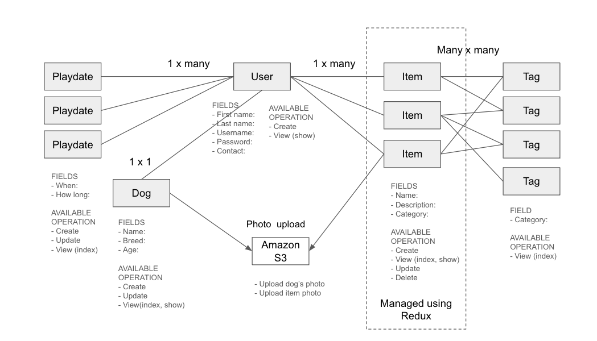

# README

## What this is

Dog Pod Portal is Mio's personal project to showcase her learning. The app is set up using:

- React 17.0.2
- Ruby 2.7.4
- NodeJS(v16), and npm
- Postgresql
- AWS S3 bucket

The intent of the Dog Pod Portal is to make the communication between a group of friends with dogs smoother. Currently we often send group texts to arrange playdates and offer free dog care items. With this portal, it's easier to create and manage your posts, and view others' posts and respond.

## To install

Since Dog pod portal uses an AWS S3 bucket to handle file upload, you need to provision your own S3 bucket to make it work.

1. Go to https://aws.amazon.com/ and log in (or create an account if you don't have one yet)
2. From the Services menu on upper left, navigate to Security, Identify, & Compliance > IAM.
3. From the left hand nav, go to Users.
4. Add a new user with the AmazonS3FullAccess permission, then grab its access key ID.
5. From the Services menu on upper left, navigate to Storage > S3.
6. Create a new bucket. Disable all the blocks for public access.
7. Set the bucket policy as follows:

```
{
    "Version": "2012-10-17",
    "Statement": [
        {
            "Sid": "PublicRead",
            "Effect": "Allow",
            "Principal": "*",
            "Action": [
                "s3:GetObject",
                "s3:PutObject",
                "s3:GetObjectVersion"
            ],
            "Resource": "arn:aws:s3:::us-west-dogpod/*"
        }
    ]
}
```

8. Within the bucket you created, set up development > attachment folders.
9. Access NOTES.md, and follow its instruction to set the credential settings.
   Now the files you upload wiill be stored in the S3 bucket you set up.

## To start

- To start the backend, run rails s
- To start the frontend, run npm start --prefix client

## What it does

- Signup & login
  Dog Pod portal has a secure login feature. Passwords are hashed using bcrypt.

- Members page
  Renders the information of our users' dogs. Each dog's panel also shows their owner's name as the dog model and the user model have one to one relationship. If you are the owner of the dog, the Update and Delete buttons will be shown.

- Free items page
  The dog care items the members no longer need are offered here. Item components offers full CRUD feature. The page has a form to add more items. If you are the owner of the item, you will be the Update and Delete buttons. Each item can be tagged with mutliple categories, and you can use those categories to filter items. It also has a word search feature.

- Playdates page
  This page lets you create and post your playdate requests, as well as volunteer to host other members' dogs.

## Data structure


For the "implement one new technology" requirement, I added a file upload feature. An Amazon S3 bucket is configured to accept the images submitted from the item and dog forms.

Redux is implemented to handle all the state changes with the Items component.
